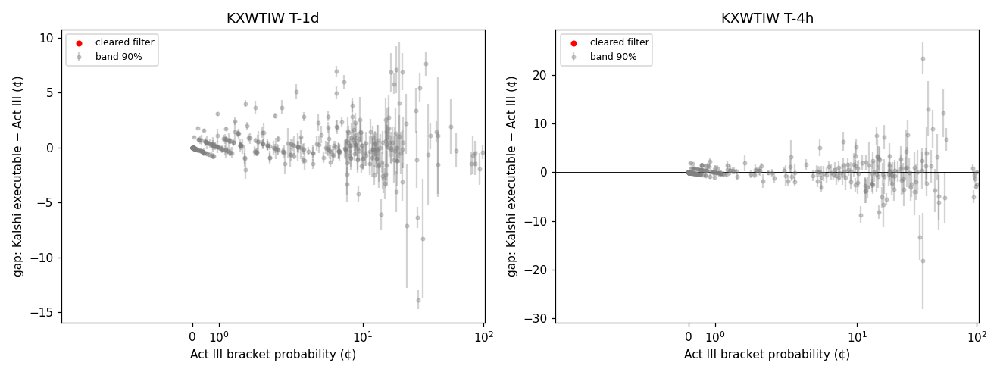
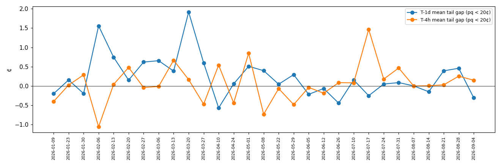
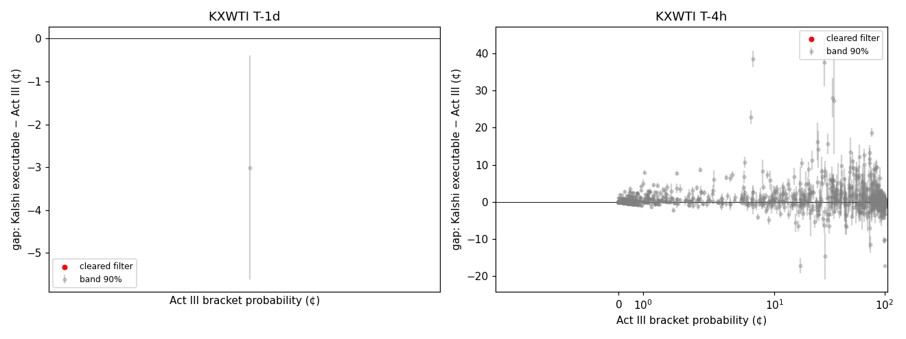
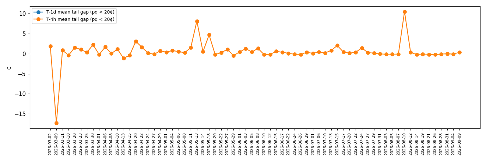

# FINDINGS_BACKTEST — extracted densities against Kalshi bracket prices

Protocol: `BACKTEST_PROTOCOL.md`, committed 2026-10-03T21:11:29-05:00 (`675d6df`). Extractor frozen at `synth.realchain` arm `real_m48_f1` (48 knots, Gaussian prior, real intraday path, 1¢ tick floor). Every number below is computed from `synth/results_backtest/runs_<series>.pkl`; the denominator and bracket logs are the CSVs next to it. Executable prices only: Kalshi bid/ask closes of the stored 1-minute candle at the snapshot minute, CME TBBO last quotes in the window.

**Verdict: STRUCTURE, NOT AN EDGE — the two venues agree to within a cent, and the hedge cannot be priced from the stored data.**
On the 24 KXWTIW dates that clear every gate at T-1d (22 at T-4h), Kalshi's executable bracket prices sit on top of the
extracted density: mean gap +0.2¢, mean |gap| 1.1¢, median 0.5¢, 23% of brackets outside the 90% posterior band and
none outside band plus friction. Stage 18 finds the favourite–longshot signature at both snapshots (b = 0.69 [0.68, 0.71]
at T-1d and 0.68 [0.66, 0.70] at T-4h, and individually on 14 of 24 dates), so B1 holds — but in cents it is Kalshi
asking 2¢ for brackets the density prices at 0.6¢, which is the 1¢ tick plus a 1¢ spread, and the state tilt c changes
sign between the snapshots. No bracket clears the filter (B2 and B3 fail): the measured CME friction of the replicating
structure is 7–30¢ per Kalshi dollar (median 12¢; legs quoted at 4–5¢/bbl half-spread on a $0.50 spread) against gaps of
a cent, and only two brackets in the whole sample had every leg quoted within five minutes of the snapshot. The first
pass's single "trade" was a contract-assignment artifact (Kalshi settling on CLK6, the options on CLM6) and is removed by
a rule about the data, not the result. The honest summary is a null on the edge and a positive on the extractor: an
independent venue agrees with it to within a cent on 535 bracket comparisons across 24 weeks.

## 0. The bar, mechanically (protocol §2, KXWTIW, lead snapshot T-1d)

| condition | holds | detail |
|---|---|---|
| B1 structure exists | **yes** | b 90% CI [0.68, 0.71] at T-1d, [0.66, 0.70] at T-4h; c 90% CI [0.020, 0.027] at T-1d, [-0.015, -0.003] at T-4h |
| B2 tradeable edge | **no** | filtered brackets from 0 dates in 0 months; sign agreement with B1's direction (longshots rich): — |
| B3 survives friction at size | **no** | 0 trades; P&L —¢ per contract summed; dates positive —; without best three —¢ |
| **mechanical verdict** | **STRUCTURE, NOT AN EDGE** | EDGE needs all three; STRUCTURE needs B1; otherwise NULL |

## 1. KXWTIW — the study

### Denominator — KXWTIW
| outcome | T-1d | T-4h |
|---|---|---|
| cleared | 24 | 22 |
| g4_split_half_fired | 1 | 2 |
| sampler_fail | 4 | 5 |
| g0a_no_same_day_expiry | 3 | 3 |
| g0b_contract_mismatch | 3 | 3 |
| g0c_too_few_strikes | 2 | 2 |
| g0d_no_intraday_bars | 0 | 0 |
| no_kalshi_candles | 0 | 0 |
| no_kalshi_event | 0 | 0 |
| extraction_error | 0 | 0 |
| not_attempted (snapshot not run for the date) | 0 | 0 |
| **total dates** | 37 | 37 |

Bracket statuses (every bracket of every date that reached the comparison):

| status | T-1d | T-4h |
|---|---|---|
| traded | 0 | 0 |
| below_threshold | 2 | 1 |
| no_two_sided_kalshi_quote | 185 | 201 |
| date_gated | 76 | 117 |
| price_out_of_range | 93 | 133 |
| band_too_wide | 0 | 0 |
| interior_minimum | 0 | 2 |
| cme_leg_unquoted | 201 | 103 |

### Gap by moneyness — KXWTIW T-1d (lead)
Brackets with a two-sided Kalshi quote on dates that reached the comparison (gated dates included, marked in the per-date table). Gap = executable Kalshi price on the side the trade would hit − Act III posterior mean, in cents of probability; band = 90% posterior width; friction per BACKTEST_PROTOCOL §4 with measured CME half-spreads.

| band (Act III prob) | n | mean Kalshi | mean Act III | mean gap | median gap | sd | gap > 0 | mean band | mean friction | \|gap\| > band | \|gap\| > band + friction | Kalshi spread |
|---|---:|---:|---:|---:|---:|---:|---:|---:|---:|---:|---:|---:|
| deep tail | 204 | 2.1 | 1.5 | +0.2 | -0.0 | 0.9 | 43% | 0.7 | — | 25% | 0% | 1.3 |
| moderate tail | 120 | 11.4 | 10.9 | +0.2 | -0.0 | 2.1 | 48% | 2.4 | — | 19% | 0% | 2.3 |
| body | 22 | 32.8 | 33.8 | -0.6 | -0.2 | 5.0 | 45% | 4.7 | 13.8 | 23% | 0% | 3.4 |
| favourite | 5 | 88.2 | 88.0 | -1.0 | -0.7 | 0.7 | 0% | 2.4 | — | 0% | 0% | 3.2 |

### Gap by moneyness — KXWTIW T-4h
Brackets with a two-sided Kalshi quote on dates that reached the comparison (gated dates included, marked in the per-date table). Gap = executable Kalshi price on the side the trade would hit − Act III posterior mean, in cents of probability; band = 90% posterior width; friction per BACKTEST_PROTOCOL §4 with measured CME half-spreads.

| band (Act III prob) | n | mean Kalshi | mean Act III | mean gap | median gap | sd | gap > 0 | mean band | mean friction | \|gap\| > band | \|gap\| > band + friction | Kalshi spread |
|---|---:|---:|---:|---:|---:|---:|---:|---:|---:|---:|---:|---:|
| deep tail | 234 | 1.4 | 0.7 | +0.1 | +0.0 | 0.7 | 23% | 0.6 | — | 9% | 0% | 1.6 |
| moderate tail | 64 | 12.1 | 12.0 | -0.1 | -0.2 | 3.1 | 45% | 4.2 | — | 14% | 0% | 2.7 |
| body | 38 | 34.2 | 33.5 | +0.5 | +0.3 | 6.9 | 55% | 7.6 | 16.0 | 18% | 3% | 3.7 |
| favourite | 7 | 94.5 | 96.8 | -1.6 | -1.3 | 2.0 | 29% | 1.5 | — | 43% | 0% | 1.6 |

### Per date — KXWTIW
| date | snap | outcome | n two-sided | mean gap | mean tail gap (pq<20¢) | mean \|gap\| | mean band | traded | interior-min removed | χ²/strike | E[F]−F₀ (¢) | path | Stage 18 b [5,50,95] | c |
|---|---|---|---:|---:|---:|---:|---:|---:|---:|---:|---:|---|---|---|
| 2026-01-09 | T-1d | cleared | 15 | -0.1 | -0.2 | 0.7 | 1.8 | 0 | 0 | 1.14 | +0.9 | real | 0.57 [0.54, 0.60] | -0.006 [-0.019, 0.010] |
| 2026-01-23 | T-1d | cleared | 15 | -0.3 | +0.2 | 1.2 | 3.0 | 0 | 0 | 0.65 | +0.8 | real | 0.90 [0.68, 1.08] | 0.333 [0.226, 0.426] |
| 2026-01-30 | T-1d | cleared | 4 | -0.3 | -0.2 | 0.9 | 2.8 | 0 | 0 | 0.93 | +3.4 | real | 1.31 [1.09, 1.60] | -1.039 [-2.206, -0.358] |
| 2026-02-06 | T-1d | cleared | 8 | +2.2 | +1.6 | 2.9 | 2.7 | 0 | 0 | 1.10 | +0.2 | real | 1.26 [1.11, 1.37] | 0.209 [0.180, 0.239] |
| 2026-02-13 | T-1d | cleared | 9 | -0.4 | +0.7 | 1.6 | 4.3 | 0 | 0 | 0.92 | -1.1 | real | 0.71 [0.62, 0.83] | 0.087 [-0.006, 0.169] |
| 2026-02-20 | T-1d | **sampler** | 7 | +0.4 | +0.2 | 1.3 | 2.9 | 0 | 0 | 0.63 | -3.3 | real | 0.63 [0.54, 0.71] | 0.094 [0.072, 0.117] |
| 2026-02-27 | T-1d | cleared | 7 | +0.6 | +0.6 | 3.9 | 2.3 | 0 | 0 | 5.88 | +3.2 | real | 0.89 [0.78, 0.99] | 0.286 [0.262, 0.309] |
| 2026-03-06 | T-1d | **sampler** | 3 | +0.3 | +0.7 | 0.6 | 0.7 | 0 | 0 | 1.90 | +8.1 | real | — | — |
| 2026-03-13 | T-1d | cleared | 15 | +0.9 | +0.4 | 1.8 | 1.0 | 0 | 0 | 2.00 | +4.6 | real | 1.06 [0.97, 1.19] | 0.046 [0.032, 0.057] |
| 2026-03-20 | T-1d | cleared | 15 | +0.9 | +1.9 | 3.5 | 0.9 | 0 | 0 | 3.11 | +2.0 | real | 0.69 [0.56, 0.79] | 0.060 [0.034, 0.076] |
| 2026-03-27 | T-1d | cleared | 15 | +0.1 | +0.6 | 1.1 | 1.2 | 0 | 0 | 2.11 | +9.9 | real | 0.80 [0.66, 0.94] | 0.015 [-0.015, 0.043] |
| 2026-04-10 | T-1d | **split-half fired** | 4 | -0.9 | -0.6 | 1.2 | 2.0 | 0 | 1 | 2.30 | +10.4 | real | — | — |
| 2026-04-24 | T-1d | cleared | 6 | -0.2 | +0.1 | 0.6 | 1.0 | 0 | 0 | 1.49 | +16.3 | real | 0.98 [0.93, 1.04] | 0.184 [0.086, 0.284] |
| 2026-05-01 | T-1d | cleared | 10 | +0.4 | +0.5 | 0.9 | 1.0 | 0 | 0 | 1.32 | +6.1 | real | 0.92 [0.87, 0.95] | -0.006 [-0.034, 0.025] |
| 2026-05-08 | T-1d | cleared | 11 | +0.3 | +0.4 | 0.6 | 1.2 | 0 | 0 | 1.25 | +9.2 | real | 1.00 [0.90, 1.07] | 0.072 [0.032, 0.106] |
| 2026-05-22 | T-1d | cleared | 11 | +0.2 | +0.0 | 0.6 | 1.0 | 0 | 0 | 3.08 | -6.4 | real | 0.80 [0.73, 0.87] | -0.035 [-0.052, -0.016] |
| 2026-05-29 | T-1d | cleared | 11 | +0.1 | +0.3 | 0.6 | 0.7 | 0 | 0 | 0.65 | -3.0 | real | 1.03 [0.96, 1.08] | 0.230 [0.185, 0.277] |
| 2026-06-05 | T-1d | cleared | 15 | -0.1 | -0.2 | 0.5 | 1.2 | 0 | 0 | 2.46 | -5.8 | real | 0.71 [0.51, 0.92] | 0.050 [-0.027, 0.125] |
| 2026-06-12 | T-1d | cleared | 15 | -0.1 | -0.1 | 0.9 | 1.4 | 0 | 0 | 1.54 | -1.5 | real | 0.47 [0.34, 0.55] | -0.066 [-0.101, -0.047] |
| 2026-06-26 | T-1d | cleared | 14 | -0.2 | -0.4 | 1.0 | 1.3 | 0 | 0 | 0.97 | +1.3 | real | 0.99 [0.62, 1.27] | 0.211 [0.014, 0.349] |
| 2026-07-10 | T-1d | cleared | 10 | +0.2 | +0.2 | 0.7 | 2.6 | 0 | 0 | 3.16 | -0.7 | real | 0.87 [0.76, 0.93] | 0.010 [-0.007, 0.024] |
| 2026-07-17 | T-1d | cleared | 12 | -0.1 | -0.3 | 0.5 | 1.7 | 0 | 0 | 1.43 | +8.1 | real | 0.88 [0.18, 1.42] | -0.038 [-0.459, 0.501] |
| 2026-07-24 | T-1d | cleared | 25 | +0.0 | +0.0 | 0.6 | 0.7 | 0 | 0 | 2.56 | -1.6 | real | 0.27 [0.12, 0.41] | 0.153 [0.116, 0.196] |
| 2026-07-31 | T-1d | **sampler** | 25 | +0.1 | +0.1 | 0.5 | 0.9 | 0 | 0 | 1.58 | -4.7 | real | 0.75 [0.67, 0.81] | 0.037 [0.026, 0.043] |
| 2026-08-07 | T-1d | **sampler** | 16 | +0.0 | +0.0 | 0.3 | 1.1 | 0 | 0 | 1.07 | -0.6 | real | 0.92 [0.84, 0.99] | 0.029 [0.021, 0.036] |
| 2026-08-14 | T-1d | cleared | 12 | -0.2 | -0.2 | 0.3 | 1.5 | 0 | 0 | 1.08 | +5.4 | reconstruction | 0.75 [0.72, 0.81] | 0.051 [0.039, 0.061] |
| 2026-08-21 | T-1d | cleared | 17 | +0.3 | +0.4 | 0.8 | 1.7 | 0 | 0 | 1.03 | +7.3 | real | 0.69 [0.64, 0.73] | -0.060 [-0.073, -0.036] |
| 2026-08-28 | T-1d | cleared | 11 | +0.5 | +0.5 | 0.7 | 1.8 | 0 | 0 | 1.66 | +7.0 | real | 0.50 [0.47, 0.53] | 0.038 [0.030, 0.044] |
| 2026-09-04 | T-1d | cleared | 13 | -0.3 | -0.3 | 0.6 | 1.5 | 0 | 0 | 1.16 | +0.8 | real | 0.97 [0.91, 1.02] | -0.015 [-0.029, -0.002] |
| 2026-01-09 | T-4h | **sampler** | 15 | +0.3 | -0.4 | 1.0 | 1.9 | 0 | 0 | 0.77 | +1.5 | real | 0.58 [0.55, 0.65] | -0.107 [-0.199, -0.103] |
| 2026-01-23 | T-4h | cleared | 9 | +0.8 | +0.0 | 2.6 | 4.1 | 0 | 0 | 0.86 | +4.6 | real | 0.85 [0.73, 0.94] | -0.233 [-0.345, -0.087] |
| 2026-01-30 | T-4h | cleared | 15 | -0.1 | +0.3 | 0.7 | 0.5 | 0 | 0 | 2.06 | +5.4 | real | 0.75 [0.63, 0.87] | -0.072 [-0.562, 0.586] |
| 2026-02-06 | T-4h | **sampler** | 19 | +0.7 | -1.1 | 2.6 | 1.5 | 0 | 0 | 1.96 | +2.1 | real | 1.21 [1.01, 1.39] | 0.115 [0.060, 0.165] |
| 2026-02-13 | T-4h | cleared | 4 | -2.3 | +0.0 | 2.4 | 6.7 | 0 | 0 | 0.82 | -1.1 | real | 0.65 [0.53, 0.74] | -0.154 [-0.274, -0.045] |
| 2026-02-20 | T-4h | cleared | 15 | +0.3 | +0.5 | 2.3 | 2.0 | 0 | 0 | 0.80 | -2.9 | real | 0.61 [0.58, 0.66] | -0.061 [-0.114, -0.025] |
| 2026-02-27 | T-4h | cleared | 5 | +1.5 | -0.0 | 3.0 | 5.9 | 0 | 0 | 0.70 | +2.9 | real | 0.59 [0.45, 0.69] | -0.101 [-0.151, -0.045] |
| 2026-03-06 | T-4h | **split-half fired** | 6 | +0.0 | -0.0 | 0.0 | 0.1 | 0 | 0 | 2.75 | -1.1 | real | — | — |
| 2026-03-13 | T-4h | **split-half fired** | 15 | +0.7 | +0.7 | 2.3 | 2.3 | 0 | 0 | 1.76 | -5.4 | real | 0.66 [0.48, 0.84] | -0.007 [-0.045, 0.033] |
| 2026-03-20 | T-4h | cleared | 13 | +0.2 | +0.2 | 1.4 | 2.6 | 0 | 2 | 0.98 | +2.1 | real | 0.93 [0.73, 1.12] | 0.032 [-0.006, 0.065] |
| 2026-03-27 | T-4h | **sampler** | 13 | -0.5 | -0.5 | 1.8 | 4.1 | 0 | 0 | 1.16 | -5.0 | real | 0.45 [0.33, 0.53] | -0.036 [-0.055, -0.015] |
| 2026-04-10 | T-4h | cleared | 6 | +0.0 | +0.5 | 0.9 | 0.3 | 0 | 0 | 0.87 | +7.4 | real | 0.54 [0.51, 0.62] | -0.282 [-0.344, -0.071] |
| 2026-04-24 | T-4h | cleared | 6 | -0.5 | -0.4 | 0.5 | 0.9 | 0 | 0 | 1.47 | -6.9 | real | 0.81 [0.70, 0.90] | -0.027 [-0.277, 0.243] |
| 2026-05-01 | T-4h | **sampler** | 9 | -0.9 | +0.8 | 3.5 | 6.5 | 0 | 2 | 2.21 | +21.1 | real | -0.11 [-0.34, 0.57] | 0.493 [-0.018, 0.686] |
| 2026-05-08 | T-4h | cleared | 9 | +0.1 | -0.7 | 1.6 | 2.1 | 0 | 0 | 0.76 | -4.9 | real | 1.58 [1.06, 1.96] | 0.696 [0.278, 1.044] |
| 2026-05-22 | T-4h | cleared | 11 | -0.1 | -0.1 | 1.1 | 2.1 | 0 | 0 | 1.04 | -2.3 | real | 0.47 [0.38, 0.59] | -0.077 [-0.104, -0.047] |
| 2026-05-29 | T-4h | cleared | 3 | -0.1 | -0.5 | 0.6 | 1.3 | 0 | 0 | 1.32 | +1.1 | real | — | — |
| 2026-06-05 | T-4h | cleared | 15 | -0.2 | -0.0 | 0.9 | 2.1 | 0 | 0 | 1.26 | -7.2 | real | 1.25 [1.14, 1.35] | 0.138 [0.084, 0.189] |
| 2026-06-12 | T-4h | cleared | 12 | -0.1 | -0.2 | 1.0 | 1.9 | 0 | 0 | 1.83 | +0.6 | real | 0.74 [0.59, 0.95] | 0.064 [-0.025, 0.151] |
| 2026-06-26 | T-4h | cleared | 6 | -0.1 | +0.1 | 0.4 | 0.9 | 0 | 0 | 0.81 | -3.5 | real | 0.91 [0.79, 1.03] | 0.565 [-0.022, 1.034] |
| 2026-07-10 | T-4h | cleared | 11 | -0.2 | +0.1 | 0.9 | 3.0 | 0 | 0 | 0.84 | +5.3 | real | 0.73 [0.62, 0.84] | 0.065 [-0.020, 0.121] |
| 2026-07-17 | T-4h | cleared | 2 | -0.7 | +1.5 | 2.2 | 1.0 | 0 | 0 | 1.00 | +11.5 | real | — | — |
| 2026-07-24 | T-4h | cleared | 25 | +0.0 | +0.2 | 0.4 | 1.3 | 0 | 0 | 1.12 | +6.8 | real | 0.77 [0.70, 0.82] | 0.064 [0.022, 0.094] |
| 2026-07-31 | T-4h | cleared | 13 | +0.1 | +0.5 | 1.1 | 2.1 | 0 | 0 | 1.10 | +6.7 | real | 0.59 [0.56, 0.64] | -0.010 [-0.031, 0.012] |
| 2026-08-07 | T-4h | cleared | 26 | -0.0 | -0.0 | 0.2 | 0.9 | 0 | 0 | 1.15 | -0.9 | real | 0.80 [0.73, 0.88] | -0.053 [-0.095, -0.003] |
| 2026-08-14 | T-4h | cleared | 10 | +0.1 | +0.0 | 0.3 | 2.8 | 0 | 0 | 0.95 | +0.5 | reconstruction | 0.86 [0.74, 0.94] | -0.081 [-0.144, -0.024] |
| 2026-08-21 | T-4h | **sampler** | 27 | +0.0 | +0.0 | 0.2 | 1.1 | 0 | 0 | 1.00 | +2.0 | real | 0.58 [0.56, 0.60] | -0.007 [-0.012, -0.001] |
| 2026-08-28 | T-4h | cleared | 13 | -0.2 | +0.3 | 0.8 | 2.4 | 0 | 0 | 0.77 | -1.1 | real | 0.59 [0.58, 0.61] | 0.004 [0.001, 0.012] |
| 2026-09-04 | T-4h | cleared | 10 | +0.1 | +0.1 | 1.0 | 2.3 | 0 | 0 | 1.32 | +6.7 | real | 0.76 [0.68, 0.82] | -0.049 [-0.066, -0.026] |

### Stage 18, pooled — KXWTIW
Per posterior draw, logit(Kalshi mid) = a_date + b·logit(p^Q) + c·(bracket midpoint − F₀, $); brackets with a two-sided quote and mid in [1¢, 99¢]; p^Q clipped at 10⁻³. b < 1 is the favourite–longshot bias, c ≠ 0 the state tilt.

| snapshot | dates | brackets | b [5, 50, 95%] | b CI below 1 | c [5, 50, 95%] | c CI excludes 0 |
|---|---:|---:|---|---|---|---|
| T-1d | 24 | 259 | 0.69 [0.68, 0.71] | yes | 0.023 [0.020, 0.027] | yes |
| T-4h | 22 | 164 | 0.68 [0.66, 0.70] | yes | -0.009 [-0.015, -0.003] | yes |

### Stage 19 — brackets clearing the filter, KXWTIW T-1d
None.

### Stage 19 — brackets clearing the filter, KXWTIW T-4h
None.

### The signal record — KXWTIW
Brackets on cleared dates that did not become trades, by reason, with what the gap did against the band alone and against the band plus friction. Where the legs were not all quoted in the window the friction is the chain-estimated one (protocol amendment 3) and the bracket is a *signal*, not a trade.

- T-1d, legs quoted, below threshold: 2 brackets; |gap| > band alone on 0%; shortfall to band + friction median 16.5¢ (p90 19.5¢); gap > 0 on 100%.
- T-1d, legs not all quoted in the window: 201 brackets; |gap| > band alone on 26%; estimated friction median 13.6¢ (p10 7.6¢, p90 34.3¢); **0 would clear band + estimated friction** on 0 dates (—).
- T-4h, legs quoted, below threshold: 1 brackets; |gap| > band alone on 100%; shortfall to band + friction median 18.4¢ (p90 18.4¢); gap > 0 on 100%.
- T-4h, legs not all quoted in the window: 103 brackets; |gap| > band alone on 14%; estimated friction median 11.6¢ (p10 7.6¢, p90 22.9¢); **0 would clear band + estimated friction** on 0 dates (—).

## 2. Artifact checks (protocol §7)

- **Residual forward error.** Median |E[F] − F₀| at T-1d: 3.4¢; correlation of the per-date mean gap with it: -0.08.
- **Asynchronicity / snapshot dependence.** 271 brackets quoted at both snapshots: gap sign agrees on 49%, correlation 0.14. Path sources by snapshot: {"T-1d": {"real": 28, "reconstruction": 1}, "T-4h": {"real": 28, "reconstruction": 1}}.
- **Extractor-independence.** The chain's own replicating-structure digital (mid, legs ≤ 5 min old, parity-converted) against Act III on 2 brackets: mean |chain − Act III| 17.7¢ (median 17.7¢); Kalshi − chain digital +1.5¢ vs Kalshi − Act III +0.3¢; the two disagreements have the same sign on 100% of brackets.
- **Stale legs are not prices.** The same digital from the last TBBO quote within 60 minutes (the first pass's definition) on 97 brackets: mean |chain − Act III| 35.3¢ (median 17.5¢). A quote attached to a trade half an hour old carries half an hour of underlying movement; it is why amendment 5 exists.
- **Contract assignment (Gate 0b, ex post).** 6 date-snapshots removed because Kalshi settled on a different delivery month than the options: 2026-01-16 T-1d — Kalshi settled 59.44 = NYMEX CLG6; the option underlying CLH6 settled 59.34 (source of the match: calendar); 2026-01-16 T-4h — Kalshi settled 59.44 = NYMEX CLG6; the option underlying CLH6 settled 59.34 (source of the match: calendar); 2026-04-17 T-1d — Kalshi settled 83.85 = NYMEX CLK6; the option underlying CLM6 settled 82.59 (source of the match: calendar); 2026-04-17 T-4h — Kalshi settled 83.85 = NYMEX CLK6; the option underlying CLM6 settled 82.59 (source of the match: calendar); 2026-05-15 T-1d — Kalshi settled 105.42 = NYMEX CLM6; the option underlying CLN6 settled 101.02 (source of the match: calendar); 2026-05-15 T-4h — Kalshi settled 105.42 = NYMEX CLM6; the option underlying CLN6 settled 101.02 (source of the match: calendar).
- **One-snapshot systematic error.** Stage 18 by snapshot is in §1's pooled table; B1 requires both snapshots to agree.

## 3. KXWTI — the secondary arm (own denominator, never pooled into the bar)

Mechanical reading on the same conditions, for the record only (lead T-4h): B1 yes, B2 no, B3 no → STRUCTURE, NOT AN EDGE. single snapshot (T-4h): b 90% CI [0.85, 0.91], c [0.042, 0.092]; the two-snapshot agreement the protocol asks for cannot be tested

### Denominator — KXWTI
| outcome | T-1d | T-4h |
|---|---|---|
| cleared | 0 | 46 |
| g4_split_half_fired | 1 | 10 |
| sampler_fail | 0 | 17 |
| g0a_no_same_day_expiry | 0 | 49 |
| g0b_contract_mismatch | 0 | 8 |
| g0c_too_few_strikes | 0 | 2 |
| g0d_no_intraday_bars | 0 | 0 |
| no_kalshi_candles | 4 | 0 |
| no_kalshi_event | 0 | 0 |
| extraction_error | 0 | 0 |
| not_attempted (snapshot not run for the date) | 127 | 0 |
| **total dates** | 132 | 132 |

Bracket statuses (every bracket of every date that reached the comparison):

| status | T-1d | T-4h |
|---|---|---|
| traded | 0 | 0 |
| below_threshold | 0 | 57 |
| no_two_sided_kalshi_quote | 106 | 183 |
| date_gated | 1 | 506 |
| price_out_of_range | 0 | 492 |
| band_too_wide | 0 | 0 |
| interior_minimum | 0 | 8 |
| cme_leg_unquoted | 0 | 410 |

### Gap by moneyness — KXWTI T-1d (lead)
Brackets with a two-sided Kalshi quote on dates that reached the comparison (gated dates included, marked in the per-date table). Gap = executable Kalshi price on the side the trade would hit − Act III posterior mean, in cents of probability; band = 90% posterior width; friction per BACKTEST_PROTOCOL §4 with measured CME half-spreads.

| band (Act III prob) | n | mean Kalshi | mean Act III | mean gap | median gap | sd | gap > 0 | mean band | mean friction | \|gap\| > band | \|gap\| > band + friction | Kalshi spread |
|---|---:|---:|---:|---:|---:|---:|---:|---:|---:|---:|---:|---:|
| deep tail | 0 | | | | | | | | | | | |
| moderate tail | 0 | | | | | | | | | | | |
| body | 1 | 45.0 | 23.0 | -3.0 | -3.0 | — | 0% | 5.2 | — | 0% | 0% | 50.0 |
| favourite | 0 | | | | | | | | | | | |

### Gap by moneyness — KXWTI T-4h
Brackets with a two-sided Kalshi quote on dates that reached the comparison (gated dates included, marked in the per-date table). Gap = executable Kalshi price on the side the trade would hit − Act III posterior mean, in cents of probability; band = 90% posterior width; friction per BACKTEST_PROTOCOL §4 with measured CME half-spreads.

| band (Act III prob) | n | mean Kalshi | mean Act III | mean gap | median gap | sd | gap > 0 | mean band | mean friction | \|gap\| > band | \|gap\| > band + friction | Kalshi spread |
|---|---:|---:|---:|---:|---:|---:|---:|---:|---:|---:|---:|---:|
| deep tail | 490 | 2.0 | 0.9 | +0.4 | -0.0 | 1.3 | 36% | 0.7 | 8.8 | 22% | 0% | 1.7 |
| moderate tail | 129 | 13.1 | 11.2 | +1.1 | +0.4 | 4.9 | 60% | 3.2 | 11.4 | 19% | 2% | 2.9 |
| body | 234 | 52.2 | 49.4 | +2.2 | +1.1 | 5.6 | 65% | 5.2 | 15.5 | 26% | 0% | 3.1 |
| favourite | 605 | 96.7 | 97.2 | +0.0 | +0.0 | 1.6 | 56% | 1.1 | 9.6 | 15% | 0% | 1.7 |

### Per date — KXWTI
| date | snap | outcome | n two-sided | mean gap | mean tail gap (pq<20¢) | mean \|gap\| | mean band | traded | interior-min removed | χ²/strike | E[F]−F₀ (¢) | path | Stage 18 b [5,50,95] | c |
|---|---|---|---:|---:|---:|---:|---:|---:|---:|---:|---:|---|---|---|
| 2026-03-11 | T-1d | **split-half fired** | 1 | -3.0 | — | 3.0 | 5.2 | 0 | 19 | 2.60 | +21.4 | real | — | — |
| 2026-03-02 | T-4h | **split-half fired** | 6 | -0.4 | +1.9 | 5.3 | 7.4 | 0 | 2 | 3.22 | +0.3 | real | -0.19 [-0.21, -0.14] | 0.403 [0.368, 0.422] |
| 2026-03-06 | T-4h | **split-half fired** | 3 | -0.3 | — | 0.9 | 0.6 | 0 | 0 | 2.75 | -1.1 | real | — | — |
| 2026-03-09 | T-4h | **split-half fired** | 15 | +5.8 | -17.3 | 8.6 | 4.3 | 0 | 43 | 3.73 | -6.7 | real | 0.00 [-0.97, 1.14] | -0.276 [-0.534, 0.029] |
| 2026-03-11 | T-4h | **split-half fired** | 15 | +1.0 | +0.9 | 1.8 | 3.5 | 0 | 12 | 10.90 | -14.2 | real | 0.03 [-0.05, 0.09] | -0.211 [-0.236, -0.191] |
| 2026-03-13 | T-4h | **split-half fired** | 11 | +0.1 | — | 2.6 | 2.0 | 0 | 0 | 1.76 | -5.4 | real | 1.03 [0.68, 1.89] | 0.349 [0.182, 0.893] |
| 2026-03-18 | T-4h | **sampler** | 15 | +2.4 | -0.4 | 3.0 | 3.7 | 0 | 13 | 1.40 | -20.2 | real | 0.22 [-0.57, 0.65] | -0.288 [-0.754, -0.067] |
| 2026-03-20 | T-4h | cleared | 15 | +0.5 | +1.6 | 2.4 | 2.3 | 0 | 9 | 0.98 | +2.1 | real | 0.28 [-0.00, 0.66] | -0.312 [-0.524, -0.030] |
| 2026-03-23 | T-4h | cleared | 15 | -0.1 | +1.0 | 2.7 | 2.0 | 0 | 0 | 1.61 | -11.4 | real | 0.46 [0.13, 1.28] | -0.074 [-0.224, 0.307] |
| 2026-03-25 | T-4h | cleared | 15 | +0.1 | +0.3 | 0.8 | 2.6 | 0 | 0 | 2.41 | -11.1 | real | 0.58 [0.23, 1.05] | -0.241 [-0.458, 0.061] |
| 2026-03-27 | T-4h | **sampler** | 9 | +1.1 | — | 1.7 | 2.2 | 0 | 0 | 1.16 | -5.0 | real | 0.57 [0.45, 1.06] | 0.011 [-0.048, 0.306] |
| 2026-03-30 | T-4h | **split-half fired** | 23 | +2.8 | +2.3 | 3.0 | 2.5 | 0 | 14 | 2.42 | +2.1 | real | 0.56 [0.45, 0.75] | -0.035 [-0.089, 0.055] |
| 2026-04-01 | T-4h | cleared | 15 | +2.0 | -0.2 | 2.4 | 2.4 | 0 | 0 | 1.41 | -15.5 | real | 1.29 [-2.77, 3.51] | 0.185 [-2.365, 1.570] |
| 2026-04-06 | T-4h | cleared | 15 | +1.2 | +1.7 | 2.7 | 2.2 | 0 | 0 | 2.10 | +10.7 | real | -0.98 [-1.73, -0.47] | -1.018 [-1.429, -0.703] |
| 2026-04-08 | T-4h | **sampler** | 35 | +0.2 | +0.1 | 0.9 | 1.7 | 0 | 0 | 1.25 | +10.5 | real | 0.86 [0.73, 1.03] | 0.027 [-0.027, 0.107] |
| 2026-04-10 | T-4h | cleared | 24 | +0.9 | +1.1 | 1.8 | 2.3 | 0 | 0 | 0.87 | +7.4 | real | 0.73 [0.52, 1.07] | 0.004 [-0.112, 0.212] |
| 2026-04-13 | T-4h | **sampler** | 21 | +0.6 | -1.1 | 1.7 | 1.5 | 0 | 0 | 1.98 | +5.8 | reconstruction | -0.70 [-1.17, -0.35] | -0.970 [-1.255, -0.746] |
| 2026-04-15 | T-4h | cleared | 25 | -0.8 | -0.4 | 1.2 | 1.4 | 0 | 0 | 1.16 | -14.0 | reconstruction | 0.72 [0.56, 0.96] | 0.017 [-0.096, 0.168] |
| 2026-04-20 | T-4h | cleared | 22 | +3.4 | +3.1 | 3.6 | 1.3 | 0 | 0 | 2.16 | +5.6 | real | 0.79 [0.66, 0.88] | 0.048 [-0.034, 0.092] |
| 2026-04-22 | T-4h | **sampler** | 17 | +1.3 | +1.6 | 1.5 | 2.6 | 0 | 0 | 1.40 | -6.7 | real | 1.05 [0.62, 1.70] | 0.232 [-0.101, 0.749] |
| 2026-04-24 | T-4h | cleared | 14 | +0.3 | +0.2 | 1.1 | 2.7 | 0 | 0 | 1.47 | -6.9 | real | 1.10 [0.79, 1.61] | 0.099 [-0.128, 0.477] |
| 2026-04-27 | T-4h | **sampler** | 13 | -0.3 | -0.1 | 0.7 | 3.5 | 0 | 0 | 1.28 | +1.7 | real | 0.79 [0.01, 1.44] | -0.074 [-0.735, 0.477] |
| 2026-04-29 | T-4h | cleared | 21 | -0.2 | +0.7 | 1.1 | 1.7 | 0 | 0 | 0.93 | -16.1 | real | 0.68 [0.55, 0.91] | -0.009 [-0.123, 0.145] |
| 2026-05-01 | T-4h | **sampler** | 15 | +0.2 | +0.4 | 1.8 | 2.9 | 0 | 0 | 2.21 | +21.1 | real | 0.23 [-0.24, 1.21] | -0.426 [-0.844, 0.364] |
| 2026-05-04 | T-4h | cleared | 14 | +0.5 | +0.8 | 0.9 | 2.9 | 0 | 0 | 0.81 | -8.1 | real | 0.74 [0.44, 1.21] | -0.133 [-0.349, 0.238] |
| 2026-05-06 | T-4h | cleared | 19 | -0.1 | +0.5 | 1.0 | 2.2 | 0 | 0 | 2.54 | -12.0 | real | 0.90 [0.55, 1.45] | 0.095 [-0.124, 0.446] |
| 2026-05-08 | T-4h | cleared | 15 | -0.2 | +0.3 | 0.9 | 2.3 | 0 | 0 | 0.76 | -4.9 | real | 0.80 [0.48, 1.18] | -0.132 [-0.346, 0.127] |
| 2026-05-11 | T-4h | **split-half fired** | 14 | +0.3 | +1.5 | 4.9 | 2.5 | 0 | 12 | 20.53 | -52.3 | reconstruction | 0.15 [0.14, 0.16] | -0.663 [-0.672, -0.654] |
| 2026-05-13 | T-4h | cleared | 15 | +1.9 | +8.2 | 2.3 | 3.1 | 0 | 0 | 1.20 | -6.3 | reconstruction | 0.86 [0.64, 1.35] | 0.090 [-0.157, 0.699] |
| 2026-05-14 | T-4h | cleared | 13 | +0.9 | +0.5 | 1.1 | 1.4 | 0 | 0 | 1.15 | +3.9 | reconstruction | 1.31 [0.94, 1.68] | 0.536 [0.168, 0.900] |
| 2026-05-18 | T-4h | **split-half fired** | 14 | +3.6 | +4.7 | 5.4 | 2.3 | 0 | 12 | 8.68 | -17.1 | reconstruction | 0.53 [0.48, 0.62] | -0.175 [-0.211, -0.072] |
| 2026-05-20 | T-4h | **split-half fired** | 15 | -0.2 | -0.2 | 2.9 | 2.9 | 0 | 6 | 10.26 | +23.8 | real | 0.40 [-0.14, 0.63] | -0.293 [-0.698, -0.144] |
| 2026-05-22 | T-4h | cleared | 14 | +0.1 | +0.3 | 1.8 | 1.6 | 0 | 0 | 1.04 | -2.3 | real | 0.95 [0.05, 1.66] | 0.075 [-0.634, 0.595] |
| 2026-05-27 | T-4h | cleared | 15 | +1.0 | +1.1 | 1.2 | 1.2 | 0 | 0 | 2.57 | -7.5 | real | 0.69 [0.46, 1.14] | 0.061 [-0.169, 0.556] |
| 2026-05-29 | T-4h | cleared | 15 | +0.1 | -0.5 | 1.4 | 1.7 | 0 | 0 | 1.32 | +1.1 | real | 0.44 [-0.81, 1.36] | -0.394 [-1.718, 0.537] |
| 2026-06-01 | T-4h | cleared | 15 | +1.9 | +0.5 | 1.9 | 1.3 | 0 | 0 | 1.65 | +13.4 | real | -1.35 [-2.66, -0.35] | -2.107 [-3.260, -1.167] |
| 2026-06-03 | T-4h | **sampler** | 12 | +1.9 | +1.3 | 1.9 | 1.7 | 0 | 0 | 1.27 | -0.0 | real | 0.78 [0.43, 1.44] | -0.235 [-0.627, 0.501] |
| 2026-06-05 | T-4h | cleared | 10 | +2.0 | +0.4 | 2.3 | 2.1 | 0 | 0 | 1.26 | -7.2 | real | 1.25 [0.38, 2.15] | 0.292 [-0.747, 1.424] |
| 2026-06-08 | T-4h | **sampler** | 13 | +1.4 | +1.3 | 1.5 | 1.8 | 0 | 0 | 1.22 | +3.2 | real | 0.79 [0.65, 1.07] | 0.019 [-0.115, 0.312] |
| 2026-06-10 | T-4h | cleared | 15 | +0.3 | -0.2 | 0.8 | 1.6 | 0 | 0 | 0.74 | +0.3 | real | 1.61 [1.02, 2.19] | 0.710 [0.178, 1.257] |
| 2026-06-12 | T-4h | cleared | 15 | -0.2 | -0.2 | 0.7 | 1.4 | 0 | 0 | 1.83 | +0.6 | real | 1.26 [0.09, 2.23] | 0.296 [-0.860, 1.229] |
| 2026-06-15 | T-4h | cleared | 15 | +0.6 | +0.6 | 0.7 | 0.7 | 0 | 0 | 1.63 | +6.3 | reconstruction | — | — |
| 2026-06-17 | T-4h | **sampler** | 15 | +0.3 | +0.4 | 0.9 | 1.7 | 0 | 0 | 2.01 | -3.6 | reconstruction | 0.65 [0.44, 1.27] | -0.107 [-0.412, 0.702] |
| 2026-06-22 | T-4h | **sampler** | 14 | +0.1 | +0.1 | 0.5 | 1.2 | 0 | 0 | 0.85 | -3.6 | reconstruction | 1.30 [-1.40, 2.90] | 0.586 [-3.293, 2.856] |
| 2026-06-24 | T-4h | cleared | 15 | -0.6 | -0.1 | 0.6 | 1.3 | 0 | 0 | 1.18 | +9.2 | real | 0.86 [0.07, 1.58] | -0.063 [-1.179, 1.050] |
| 2026-06-26 | T-4h | cleared | 15 | -0.4 | -0.2 | 0.6 | 1.3 | 0 | 0 | 0.81 | -3.5 | real | 0.73 [0.49, 1.02] | -0.230 [-0.585, 0.245] |
| 2026-06-29 | T-4h | cleared | 15 | -0.0 | +0.4 | 0.8 | 1.9 | 0 | 0 | 0.75 | -3.3 | real | 0.62 [0.21, 1.23] | -0.357 [-1.050, 0.900] |
| 2026-07-01 | T-4h | cleared | 15 | +0.1 | +0.1 | 0.5 | 1.4 | 0 | 0 | 1.16 | +0.6 | real | 0.91 [0.64, 1.28] | 0.373 [-0.202, 0.974] |
| 2026-07-06 | T-4h | cleared | 15 | +0.0 | +0.5 | 0.6 | 1.8 | 0 | 0 | 1.00 | -0.6 | real | 0.43 [-0.09, 0.83] | -1.019 [-2.178, -0.109] |
| 2026-07-08 | T-4h | cleared | 15 | -0.4 | — | 0.5 | 1.2 | 0 | 0 | 1.43 | -6.5 | real | -0.15 [-1.27, 1.82] | -1.304 [-2.907, 1.216] |
| 2026-07-10 | T-4h | cleared | 30 | +0.2 | +0.2 | 0.4 | 1.5 | 0 | 0 | 0.84 | +5.3 | real | 0.89 [0.55, 1.61] | 0.135 [-0.378, 1.372] |
| 2026-07-13 | T-4h | **sampler** | 30 | -0.1 | +0.8 | 0.6 | 2.2 | 0 | 0 | 1.49 | -6.6 | reconstruction | 0.29 [-0.27, 0.83] | -0.779 [-1.576, -0.084] |
| 2026-07-15 | T-4h | cleared | 30 | +0.8 | +2.1 | 1.3 | 2.2 | 0 | 0 | 1.72 | -7.4 | reconstruction | 0.50 [0.34, 0.93] | -0.343 [-0.554, 0.234] |
| 2026-07-17 | T-4h | cleared | 30 | +0.7 | +0.4 | 1.3 | 1.9 | 0 | 0 | 1.00 | +11.5 | real | 0.75 [0.51, 1.24] | -0.162 [-0.453, 0.430] |
| 2026-07-20 | T-4h | cleared | 30 | +0.5 | +0.2 | 0.7 | 1.4 | 0 | 0 | 2.23 | +0.1 | real | -0.05 [-0.29, 0.63] | -1.128 [-1.418, -0.355] |
| 2026-07-22 | T-4h | cleared | 30 | +0.1 | +0.4 | 0.8 | 1.2 | 0 | 0 | 1.46 | -7.9 | real | 0.95 [0.23, 3.12] | 0.267 [-0.575, 2.814] |
| 2026-07-24 | T-4h | cleared | 26 | +0.8 | +1.5 | 1.1 | 1.9 | 0 | 0 | 1.12 | +6.8 | real | 0.82 [0.28, 1.29] | -0.118 [-0.703, 0.442] |
| 2026-07-27 | T-4h | cleared | 40 | +0.4 | +0.3 | 0.8 | 1.2 | 0 | 0 | 2.22 | -10.6 | real | 0.80 [0.53, 1.04] | -0.048 [-0.302, 0.186] |
| 2026-07-29 | T-4h | **sampler** | 29 | +0.0 | +0.1 | 0.9 | 1.7 | 0 | 0 | 1.74 | -1.8 | real | 0.41 [-0.16, 0.79] | -0.451 [-1.093, -0.077] |
| 2026-07-31 | T-4h | cleared | 29 | -0.5 | -0.0 | 0.7 | 1.4 | 0 | 0 | 1.10 | +6.7 | real | 0.23 [-1.33, 1.87] | -0.745 [-2.719, 1.220] |
| 2026-08-03 | T-4h | cleared | 30 | -0.2 | -0.1 | 0.3 | 1.3 | 0 | 0 | 1.99 | -0.1 | real | 1.01 [-0.78, 1.74] | 0.074 [-2.230, 0.982] |
| 2026-08-05 | T-4h | **sampler** | 30 | -0.3 | -0.1 | 0.5 | 1.1 | 0 | 0 | 1.87 | +1.0 | real | 0.19 [-1.05, 1.04] | -0.898 [-2.328, 0.059] |
| 2026-08-07 | T-4h | cleared | 28 | +0.1 | -0.1 | 0.3 | 1.1 | 0 | 0 | 1.15 | -0.9 | real | 0.53 [-1.38, 2.25] | -0.566 [-3.528, 1.966] |
| 2026-08-10 | T-4h | **split-half fired** | 28 | +4.6 | +10.5 | 5.0 | 2.7 | 0 | 25 | 27.85 | -33.8 | reconstruction | -0.06 [-0.10, -0.00] | -1.467 [-1.543, -1.364] |
| 2026-08-12 | T-4h | cleared | 30 | +0.7 | +0.3 | 0.8 | 1.4 | 0 | 0 | 0.56 | +3.0 | reconstruction | 1.18 [-1.37, 2.75] | 0.315 [-3.279, 2.520] |
| 2026-08-14 | T-4h | cleared | 28 | +0.2 | -0.2 | 0.5 | 1.3 | 0 | 0 | 0.95 | +0.5 | reconstruction | -0.15 [-1.09, 1.00] | -1.771 [-3.398, 0.042] |
| 2026-08-19 | T-4h | **sampler** | 28 | +0.3 | -0.1 | 0.5 | 1.6 | 0 | 0 | 1.22 | +2.2 | real | 0.13 [-0.99, 1.01] | -1.471 [-3.456, 0.038] |
| 2026-08-21 | T-4h | **sampler** | 27 | -0.0 | -0.2 | 0.2 | 1.4 | 0 | 0 | 1.00 | +2.0 | real | -0.12 [-1.12, 0.77] | -1.969 [-3.677, -0.464] |
| 2026-08-26 | T-4h | cleared | 30 | -0.1 | -0.2 | 0.4 | 1.4 | 0 | 0 | 1.02 | +0.0 | real | 0.67 [0.27, 2.04] | -0.235 [-0.915, 2.023] |
| 2026-08-28 | T-4h | cleared | 30 | +0.1 | -0.1 | 0.3 | 1.5 | 0 | 0 | 0.77 | -1.1 | real | 1.26 [0.88, 1.89] | 0.814 [0.163, 1.848] |
| 2026-08-31 | T-4h | cleared | 27 | +0.1 | -0.0 | 0.2 | 1.3 | 0 | 0 | 1.54 | +2.4 | real | 1.04 [-1.28, 2.15] | -0.019 [-4.086, 1.940] |
| 2026-09-02 | T-4h | **sampler** | 24 | +0.2 | — | 0.2 | 1.1 | 0 | 0 | 2.96 | +3.7 | real | 1.28 [0.74, 3.41] | 0.627 [-0.075, 3.814] |
| 2026-09-04 | T-4h | cleared | 29 | +0.0 | -0.1 | 0.3 | 1.1 | 0 | 0 | 1.32 | +6.7 | real | 0.64 [-1.80, 1.89] | -0.602 [-4.400, 1.309] |
| 2026-09-09 | T-4h | cleared | 29 | +0.6 | +0.4 | 0.8 | 1.3 | 0 | 0 | 3.71 | -3.6 | reconstruction | 1.16 [0.81, 1.75] | 0.346 [-0.167, 1.253] |

### Stage 18, pooled — KXWTI
Per posterior draw, logit(Kalshi mid) = a_date + b·logit(p^Q) + c·(bracket midpoint − F₀, $); brackets with a two-sided quote and mid in [1¢, 99¢]; p^Q clipped at 10⁻³. b < 1 is the favourite–longshot bias, c ≠ 0 the state tilt.

| snapshot | dates | brackets | b [5, 50, 95%] | b CI below 1 | c [5, 50, 95%] | c CI excludes 0 |
|---|---:|---:|---|---|---|---|
| T-1d | — | — | — | — | — | — |
| T-4h | 46 | 641 | 0.88 [0.85, 0.91] | yes | 0.066 [0.042, 0.092] | yes |

### Stage 19 — brackets clearing the filter, KXWTI T-1d
None.

### Stage 19 — brackets clearing the filter, KXWTI T-4h
None.

### The signal record — KXWTI
Brackets on cleared dates that did not become trades, by reason, with what the gap did against the band alone and against the band plus friction. Where the legs were not all quoted in the window the friction is the chain-estimated one (protocol amendment 3) and the bracket is a *signal*, not a trade.

- T-1d, legs quoted, below threshold: none.
- T-4h, legs quoted, below threshold: 57 brackets; |gap| > band alone on 23%; shortfall to band + friction median 11.4¢ (p90 24.2¢); gap > 0 on 61%.
- T-4h, legs not all quoted in the window: 410 brackets; |gap| > band alone on 24%; estimated friction median 9.4¢ (p10 5.4¢, p90 20.1¢); **0 would clear band + estimated friction** on 0 dates (—).

## 4. Plots

## 5. Reading

**What the gaps look like.** On every cleared date the picture is the same: the Kalshi ladder and the Act III density
agree bracket by bracket to about a cent. Across the 296 two-sided brackets at T-1d the mean gap is +0.2¢, the mean
|gap| 1.1¢, the median 0.5¢; 14 brackets (5%) are more than 5¢ apart and one more than 10¢. By moneyness the deep
tail runs +0.2¢ (Kalshi 2.1¢ against 1.5¢), the moderate tail +0.2¢, the body −0.6¢ on 22 brackets, the five
favourites −1.0¢. Per date, the mean tail gap is positive on 67% of dates with a mean of +0.3¢ and a standard
deviation across dates of 0.6¢ — a sign preference that is real and worth a quarter of a cent. T-4h is the same story
with smaller numbers (mean gap +0.0¢, mean |gap| 1.0¢, 9% outside the band). The posterior bands are narrow (0.7¢ in
the deep tail, 2.4¢ on the moderate tail, 4.7¢ in the body) and 23% of brackets sit outside them, which says the band
is a little tight on real chains, as the synthetic study predicted; it does not say the venues disagree.

**The structure, and why it is a cent.** Stage 18 is unambiguous in logit space: b = 0.69 pooled at T-1d, 0.68 at
T-4h, with 90% intervals a few hundredths wide, and 14 of the 24 dates with their own regression put b below 1 on
their own (the per-date median is 0.87; the pooled fit is dominated by the dates with many quoted brackets).
Restricting to brackets Kalshi prices at 5¢ or more leaves b near 0.7, so it is not only the tick. But the economic
content is small: where the density says 0.6¢, Kalshi's ask is 2.0¢ and its bid 0.7¢, and 79% of those asks are at
1¢ or 2¢ — the longshot "premium" is one tick above fair plus a one-tick spread, and selling it means selling at the
bid, which is fair. The state tilt c is +0.023 per dollar at T-1d and −0.009 at T-4h: the two snapshots disagree on
its sign, so it is not a stable risk-premium reading. B1 holds on b; the structure exists; it is not an amount of
money.

**Friction is the finding.** The writeup's working figure of ~5¢ per contract round trip is not reachable with a
four-leg option replication on a $0.50 strike grid. Measured where legs were quoted, and estimated from the
synchronised chain's own half-spreads everywhere else, the stack is 7–30¢ per Kalshi dollar (median 12¢ at T-1d, 10¢
at T-4h), of which the CME spread term alone is 7–9¢: a 4–5¢/bbl half-spread on each leg is 8–10% of a $0.50
digital. Kalshi's own fee (0.6–1.8¢) and the CME fees at 500 contracts per structure (2.8¢) are secondary. Against
this the |gap| exceeds band + friction on 0 of 296 brackets, and 0 of 201 brackets with unquoted legs would clear
with the estimated friction either. No threshold choice inside the protocol changes that; the next pass inherits
whether any replication of a $1 bracket can be built for less than the gaps.

**The hedge is not priceable from this data, and the artifacts were real.** Only two brackets at T-1d and one at T-4h
had every leg quoted within five minutes of the snapshot; the TBBO carries a BBO only at trade instants, and legs 20–60
minutes old implied digitals 35¢ away from Act III on average. The first pass took those stale legs as executable and
produced one filtered trade with a −29¢ realised loss; it was removed by amendment 5 (leg freshness), and the date
itself fell to amendment 4: Kalshi's rules named no contract, the calendar fallback said CLM6, Kalshi settled on CLK6.
Three dates (01-16, 04-17, 05-15) carry that mismatch and are Gate 0b failures ex post. Both corrections are rules
about the data, written before any verdict, and both would have produced fedarb's failure mode if left in: a smooth,
confident, mis-centred disagreement. The residual-forward check is clean (median |E[F] − F₀| 3.4¢, correlation with
the per-date gap −0.08), and the sign of a bracket's gap at T-1d predicts its sign at T-4h on 49% of 271 brackets —
chance — so what little disagreement there is does not persist across four hours.

**The denominator.** 37 KXWTIW events since January; 3 with no same-day CME weekly on disk, 3 with the wrong contract,
2 with too few strikes, 1 (T-1d) / 2 (T-4h) split-half failures, 4 / 5 sampler failures, 24 / 22 cleared. Of the
brackets on dates reaching the comparison, 185 / 201 had no two-sided Kalshi quote at the snapshot (deep tails with
no bid), 93 / 133 had an executable price outside [2¢, 98¢], 201 / 103 lacked a fresh leg; 6 brackets sat in an
interior minimum of the density (none would have traded anyway); a LOO-flagged strike sat within $1 of an edge on 148
of 728 two-sided brackets. Depth could not be established from stored data at either 50 or 500 contracts and was not
assumed.

**The daily arm says the same thing from a different ladder.** KXWTI's markets are cumulative ("Above $X"), its
T-1d snapshot has no market open, and it ran at T-4h only (amendment 6): 132 events, 49 without a same-day CME
weekly, 8 with the wrong contract — every one of them the day after Kalshi's roll in each month (03-16/17,
04-16/17, 05-15, 06-16, 07-16, 08-17), which says the "16th" convention is off by a day or two — 2 with an
unexplained basis (04-06 +$0.20, 06-15 −$4.70, flagged), 10 split-half and 17 sampler failures, 46 cleared. On
967 two-sided thresholds the mean gap is +0.4¢, the mean |gap| 1.0¢, 17% outside the band, 4% beyond 5¢; the body
(145 thresholds) runs +1.2¢ with Kalshi rich on two thirds of them, and the pooled Stage 18 gives b = 0.88
[0.85, 0.91] with c = +0.066 [0.042, 0.092] on one snapshot. Two-leg tail structures are cheaper to replicate
(estimated friction median 7¢, 60 brackets with fresh legs) and still nothing clears: 57 below threshold, 0 trades.

**What it means.** The strategy as specified — buy or sell a Kalshi bracket against a CL-option replication, held to
settlement — has no edge in this sample: not because the extraction is wrong, but because the prediction market
prices WTI weekly brackets within a cent of the options market, and the options replication costs ten times that.
The extractor passed the hardest test it has had, agreement with an independent venue on 535 brackets across 24 weeks,
and the question the next pass inherits is about the trade structure, not the density.

## 6. Parameters and assumptions in force

`KALSHI_FEE_COEF=0.07` (taker, maker 0), `CME_FEE_PER_LEG=$2.37`, `CME_EXIT_FRACTION=0.5`, `SPREAD_WIDTH=$0.50`, size 500 Kalshi contracts per standard-CL structure (50 on Micro, not available on weekly dates), Kalshi bar staleness ≤ 10 min, executable price in [2¢, 98¢], band ≤ 20¢, trough dip 2%, LOO proximity $1.00. The fee figures are assumptions to verify against the live schedules; the filter's friction uses measured half-spreads per trade.
